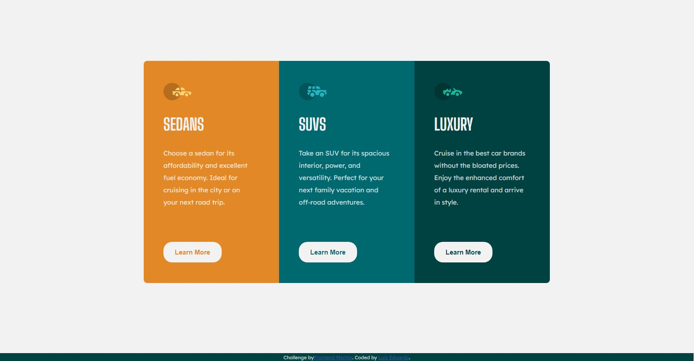

# Treinamento - 3-column-preview-card-component - Dia 4

Este mini-projeto, faz parte do meu treinamento para aprender os fundamentos para ser desenvolvedor Front-end. Para realizar esse treinamento, estou utilizando os desafios disponibilizados no [Front-end Mentor](https://www.frontendmentor.io/).

## Sumário

- [Visão Geral](#resumo)
  - [O desafio](#o-desafio)
  - [Screenshot](#screenshot)
  - [Links](#links)
- [Processo de criação](#processo-de-crição)
  - [O que foi usado?](#o-que-foi-usado?)
  - [O que eu aprendi](#o-que-eu-aprendi)
  - [Para os proximos projetos](#para-os-proximos-projetos)
  - [Recursos utilizados](#recursos-utilizados)
- [Author](#author)

## Visão Geral

### O desafio

Este projeto é resultado do [Profile card component challenge on Frontend Mentor](https://www.frontendmentor.io/challenges/3column-preview-card-component-pH92eAR2-). Os desafios do Frontend Mentor te ajudam a aprimorar suas habilidades de Front-end, com a construção de mini projetos reais.

### Screenshot

## Processo de criação

### O que foi usado?

- HTML
- CSS

### O que eu aprendi

Neste projeto, senti uma maior fluidez para desenvolver, tanto no HTML quanto no CSS. Comecei a utilizar o Media Queries, para deixar o site responsivo.

### Para os proximos projetos

Em futuros projetos, continio com o objetivo de melhorar minhas habilidades em CSS e, agora, com um maior foco em manter o site responsivo.

### Recursos utilizados

- https://www.w3schools.com/ - Utilizei bastante os recursos da W3School para relembrar de tags ou valores para finalizar o projeto.

- https://picresize.com/ - Comecei a utilizar o picresize para analisar as dimensões das imagens, dadas no design do desktop e mobile.

## Author

- Linkedin - [Luiz Eduardo](https://www.linkedin.com/in/luiz-eduardo-13901b224)
- Frontend Mentor - [@legss](https://www.frontendmentor.io/profile/legss)
